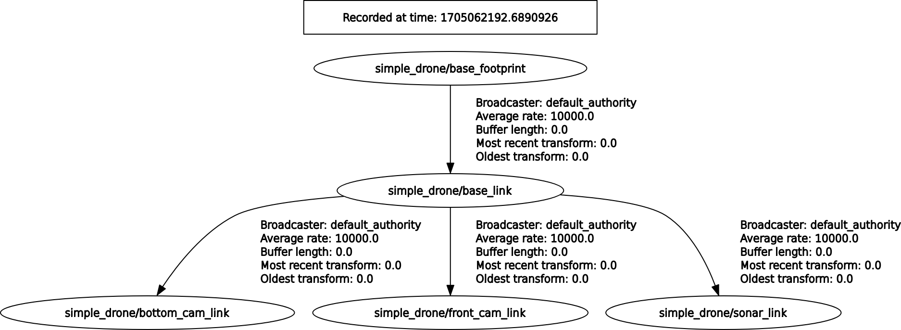

# sjtu_drone_description

This package contains the xacro/urdf/sdf model description of the sjtu drone and the corresponding Gazebo Harmonic (gz-sim8) system plugin for ROS 2 Jazzy.


## Structure

* __models__: Gazebo SDF model and model meshes
* __include__: Header files for the PID controller and drone plugin
* __src__: Source code for the drone plugin (`plugin_drone_gz.cpp`), PID controller, and private implementation
* __urdf__: Xacro and URDF model description files
* __worlds__: Contains one playground world (SDF 1.9)


## Worlds
The playground world is a minimal SDF 1.9 world with physics, scene, and lighting configured for Gazebo Harmonic. No external model downloads are required.

## TF Tree



## Generate URDF and SDF files

To generate the URDF file run the following command:

```bash
ros2 run xacro xacro -o ./urdf/sjtu_drone.urdf ./urdf/sjtu_drone.urdf.xacro params_path:="$(ros2 pkg prefix sjtu_drone_bringup)/share/sjtu_drone_bringup/config/drone.yaml"
```

To generate the SDF file run the following command:
```bash
gz sdf -p ./urdf/sjtu_drone.urdf > ./models/sjtu_drone/sjtu_drone.sdf
```